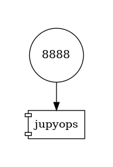

# Grade Prediction Data Registry (GPDR)

This project contains the data for a project within the Applied Machine Learning (AML) lecture.

The use case is grade prediction from log files sourced from the learn management system. The lecturer naively observes that students who actively participate in class achieve better grades. It may comprise different facets of activity. We focus on the activity log from the learn management system. It records which resources ( e.g., files, videos, assignments, students ) have been accessed during the semester.

Two students are working on an ML system for grade prediction. Their focus is on the MLops aspect and less on the machine learning model.

## Data Registry

The ML system for grade prediction works on anonymized data only. This repository contains the code to anonymize the log files. The output is organized in a [DVC data registry](https://dvc.org/doc/use-cases/data-registry/tutorial).

**Important note:** Neither the raw data nor the processed data is stored in the repository.

The data registry stores references to the remote storage for anonymized data. Students may access data using the following DVC commands. Note, access requires additional credentials.

Using this registry, we assume you have a project under `git` and `dvc` version control. List the content of this registry using the command
```
dvc list ...
```

This command just downloads the data from the registry into the project. 
```
dvc get...
```

The next command tracks the data from the project using the registry.
```
dvc import ...
```
One may issue `dvc update` to retrieve updated versions.


## Software System Setup

A `docker-compose` file provides a setup for a multi-container application
The diagram below depicts the containers, their dependencies and ports (number in circles). The diagram sources from this [medium.com article](https://medium.com/@krishnakummar/creating-block-diagrams-from-your-docker-compose-yml-da9d5a2450b4).




**Setup:** Start in project's root dir and create a `.env` file with the content shown below.
```
# .env file

# In the container, this is the directory where the code is found
# Example:
APP_ROOT=/GPDR

# the HOST directory containing directories to be mounted into containers
# Example:
VOL_DIR=/dev/GPDR
```

**Create** docker image. Please see [Dockerfiles/](Dockerfiles directory) for details.

```bash
docker-compose build jupyops
```

**Spin up** the containers and get a shell from a container
```bash
docker-compose up -d jupyops
```

Finally, point you browser to http://localhost:8888 to load the jupyterlab editor.

## License

Information provided in the [LICENSE](LICENSE) file.
